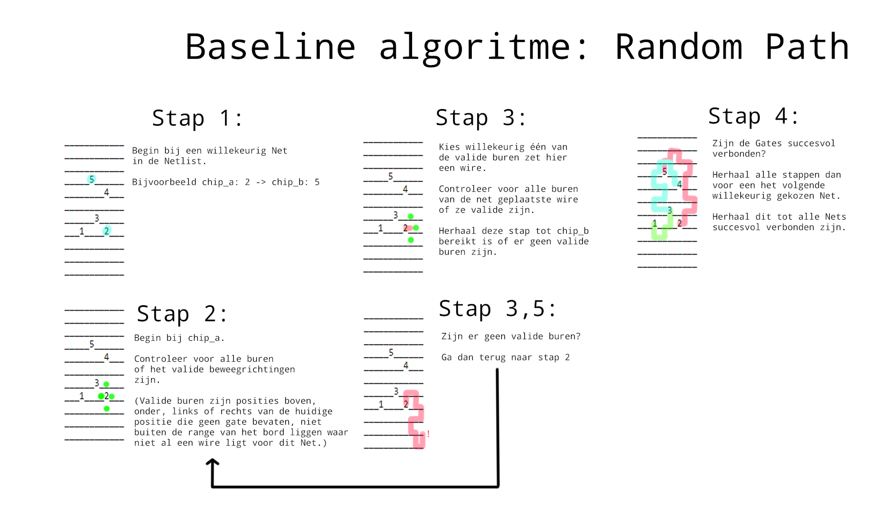

# Classes
De classes folder bevat de diverse classes die gebruikt worden om het probleem en de oplossing te representeren. In deze folder vind je:

## netlist.py
Bevat de Net en Netlist classes.

### Net
Een connectie tussen twee **Gate**s. Bevat de volgende variabelen:
* **self.gates**: een tuple met twee Gate objects die door het net verbonden dienen te worden;
* **self.wiring**: een lijst met tuples bestaande uit een x en y coördinaat (integers) die de positie van de wire fragmenten aangeeft.

Bevat de volgende method(s):
* **add_wire(self, x, y):** voegt een wire fragment toe aan self.wiring;
* **clear_wiring(self):** verwijderd alle wires in self.wiring;
* **direct_distance(self)**: geeft de hemelsbrede afstand tussen de twee gates;
* **get_wire_positions(self):** geeft een lijst van tuples met de x en y coördinaten (integers) van alle wires van het net;
* **unadd_wire(self):** verwijdert de laatste wire die aan self.wiring is toegevoegd.

### Netlist
Een collectie **Net**s. Bevat de volgende variabelen:
* **self.nets:** een dictionary met net_IDs als keys en hun corresponderende **Net** objects als waardes.

Bevat de volgende method(s):
* **get_wire_count(self):** geeft het totale aantal draad fragmenten in net.wiring for alle nets in de netlist;
* **check_intersection(self, net2):** geeft true als er een intersectie is tussen self en net2. Anders false;
* **direct_distances(self):** geeft een lijst met de hemelsbrede afstanden tussen de gates van elk net in self.nets;
* **get_cost(self):** geeft de cost waarde als integer;
* **get_intersections(self):** geeft een lijst met alle kruisende **nets** en de coördinaten van de kruising;
* **get_net_id(self, net):** geeft het net_ID van het gegeven Net;
* **get_wire_count(self):** geeft het aantal wires in alle Nets in de netlist. De draad op gates maar één keer meegenomen.

## gate.py
Bevat de Gate class.

### Gate
Een component die door middel van connecties (**Net**s) aan andere gates verbonden moet worden. Bevat de volgende variabelen:
* **self.id**: een unieke identifier (integer);
* **self.position:** een set coördinaten (integers).

Bevat de volgende method(s):

* **get_distance(self, other_gate):** geeft de hemelsbrede afstand tussen self en de gegeven gate.

## wire.py
Bevat de Wire class

### Wire
Een draadcomponent in een **Net**. Bevat de volgende variabelen:
* **self.x:** een integer die de x coördinaat representeert;
* **self.y:** een integer die de y coördinaat representeert.
* **self.y:** een integer die de z coördinaat representeert.

## intersection.py
Bevat de Intersection class

### Intersection
Een overlap tussen twee **Net**s. Bevat de volgende variabelen:
* **self.net1:** een Net object dat met net2 overlapt;
* **self.net2:** een net object dat met net1 overlapt;
* **self.x:** een integer die de x coördinaat representeert;
* **self.y:** een integer die de y coördinaat representeert;
* **self.z:** een integer die de z coördinaat representeert.

## circuit.py
Bevat de Circuit class

### Circuit
Een canvas met **Gate**s en **Netlist**s. Bevat de volgende variabelen:
* **self.netlists:** een lijst met Netlist objects;
* **self.gates:** een lijst met Gate objects;
* **self.border:** een integer die de lengte en breedte van een potentiële border aanduidt.

Bevat de volgende methode(s):
* **self.any_intersections(self, netlist_id):** geeft een boolean die aangeeft of er wel of niet een intersection tussen de draden van Nets in de is;
* * **self.check_position(self, x, y):** geeft een triple met booleans die respectievelijk aangeven of de positie met de gegeven coördinaten buiten de range van de grid is, een Gate bevat of een Wire bevat;
* **self.check_position(self, position):** geeft een triple van booleans die respectievelijk aangeven of er op de gegeven positie een border, Gate of Wire aanwezig is;
* **self.connect_gate(self, possible_pos, netlist_id, net_id):** voegt de laatste wire toe aan de wiring van een net;
* **self.connect_gates(self, netlist_id, net_id):** verbindt de gates in een net met wire;
* **self.get_gate_entrances(self, gate):** geeft een lijst met ingangen van een gate die nog niet bezet zijn;
* **self.get_gate_positio(self, gate_id):** geeft de positie van de Gate object met het gegeven id;
* **self.get_net(self, netlist_id, net_id):** geeft het Net object met het gegeven id;
* **self.get_net_start(self, netlist_id, net):** geeft de coördinaten van de eerste Gate van een Net;
* **self.is_connected(self, netlist_id, net_id):** geeft een boolean die aangeeft of de Gates in een Net wel of niet geldig met Wire verbonden zijn;
* **self.lay_shortest_line(self, netlist_id, net_id):** geeft een zigzaggende variant van de manhattan dustance tussen de twee Gates in een Net;
* **self.move_level(self, netlist_id, net_id, n_level):** verhoogt de z-coördinaten van de wiring van een gegeven net met n niveaus;
* **self.lay_wre(self, netlist_id, net_id, position):** voegt een Wire met de gegeven positie toe aan een Net;
* **self.list_shortest_distance(self, netlist_id):** geeft een gesorteerde lijst met alle hemelsbrede afstanden tussen de gates van Nets.
* **self.load_netlist(self, path):** laadt een netlist in en voegt deze toe aan self.netlists;
* **self.make_grid(self, factor):** maakt een grid met een oppervlakte afhankelijk van de gegeven factor;
* **self.next_position(self, netlist_id, net_id):** geeft een lijst met vrije coördinaten vanaf de laatste wire in de wiring van een Net;
* **self.undo_lay(self, netlist_id, net_id):** haalt de laat aangelegde Wire eenheid van een gegeven Net weg;
* **self.plot_grid(self, title):** geeft een 3D-projectie figuur waar de Gates en Wires van het Circuit weergegeven worden;
* **self.wires_connected(self, wire1, wire2):** geeft een boolean die aangeeft of twee draden verbonden zijn of niet.

Het printen van een **Circuit** object geeft een array waar lege plekken weergegeven worden met een **underscore**, gates met hun **id**, draden met een **punt** en intersecties met een **x**. 

# Algorithms
De algorithms folder bevat de diverse algoritmes om oplossingen voor het Chips & Circuits probleem te vinden. In deze folder vind je:

## random.py
Bevat de code voor ons baseline algoritme: **Random Path**. Dit algoritme werkt als volgt:

random.py bevat de volgende functies:

* **wire_net(circuit, net):** maakt de draden voor een gegeven Net aan door willekeurige, valide posities te kiezen. Begin opnieuw als de draad vast komt te zitten.
